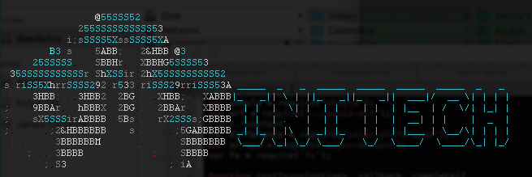

Multiline Output
----------------

Because you are rendering inline styles into a block format, you have a bleeding problem from line to line, if you stitch the lines together line-by-line. Because all parts are rendered individually, it has the opportunity to make the best decision about output dimensions and code termination, leaving you with a simple chaining API.

So rather than chaining a context, like you do in chalk, ascii-art chaining represents rendering into a line buffer (and all the seaming is done for you). It will take images, single line or multi-line chunks of varying lengths and happily weld it all together on a baseline like this:

    art.font('Prompt', 'Basic', 'red').font('v1', 'Doom', 'magenta', function(rendered){
        console.log(rendered);
    });

and that will look like this (in color, of course) and it will totally respect the multiline chars and add in ansi codes per line, so things look how you'd expect:

    d8888b. d8888b.  .d88b.  .88b  d88. d8888b. d888888b         __  
    88  `8D 88  `8D .8P  Y8. 88'YbdP`88 88  `8D `~~88~~'        /  |
    88oodD' 88oobY' 88    88 88  88  88 88oodD'    88    __   __`| |
    88~~~   88`8b   88    88 88  88  88 88~~~      88    \ \ / / | |
    88      88 `88. `8b  d8' 88  88  88 88         88     \ V / _| |_
    88      88   YD  `Y88P'  YP  YP  YP 88         YP      \_/  \___/

Of course to match the `.font()` chain, there is also an `image()` chain, you can blend them like so:

    art.image({
    	width : 40,
    	filepath : parentDir+'/Images/initech.png',
    	alphabet : 'wide'
    }).font('INITECH', 'Doom', 'cyan', function(ascii){
		console.log(ascii);
    });

Which produces something like:

