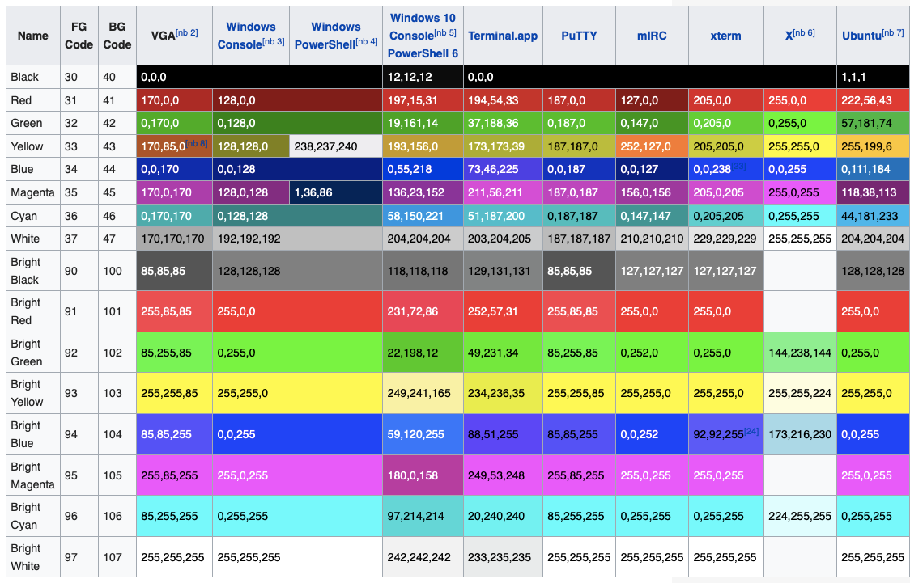

Styles
------
ANSI terminals allow us to output style which format the text in the terminal. In order to do this you just need to:

    art.style('my text', 'red+underline');

1. **colors**
Foreground colors for characters are: black, red, green, yellow, blue, magenta, cyan, white and in some terminal environments:  bright_black, bright_red, bright_green, bright_yellow, bright_blue, bright_magenta, bright_cyan, bright_white (These generally default to their non-bright variants on systems without them)

2. **background colors**
Background terminal colors available are: black_bg, red_bg, green_bg, yellow_bg, blue_bg, magenta_bg, cyan_bg, white_bg

3. **styles**
To style the text you may use: bold, italic, underline, framed, encircled, overline, blink, inverse

4. **controls**
Control styles are: off, hidden

5. **colors**

## Color Tables

**16 Colors (4bit)**

**256 colors (8bit)**

